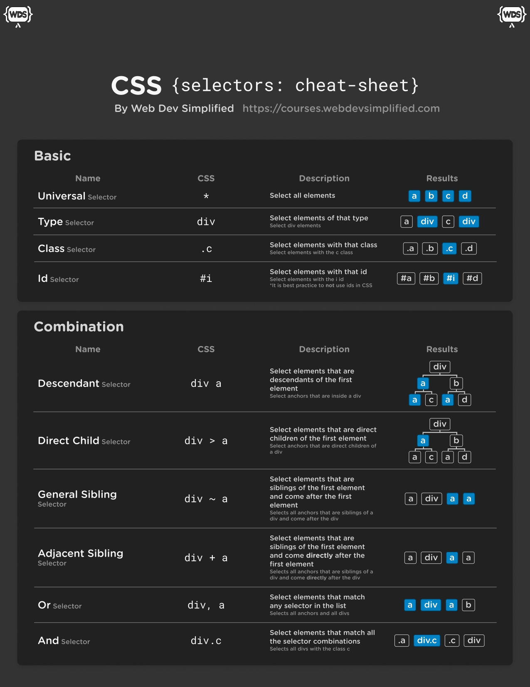
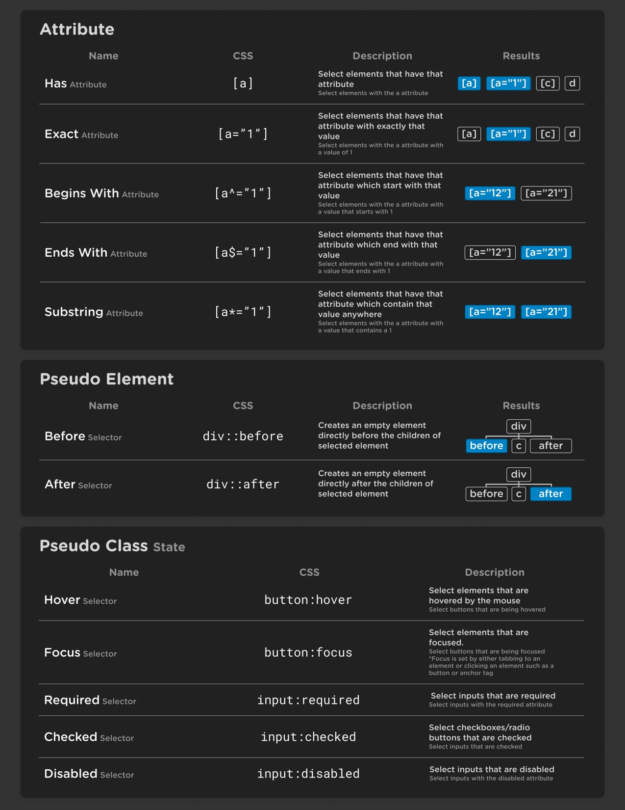
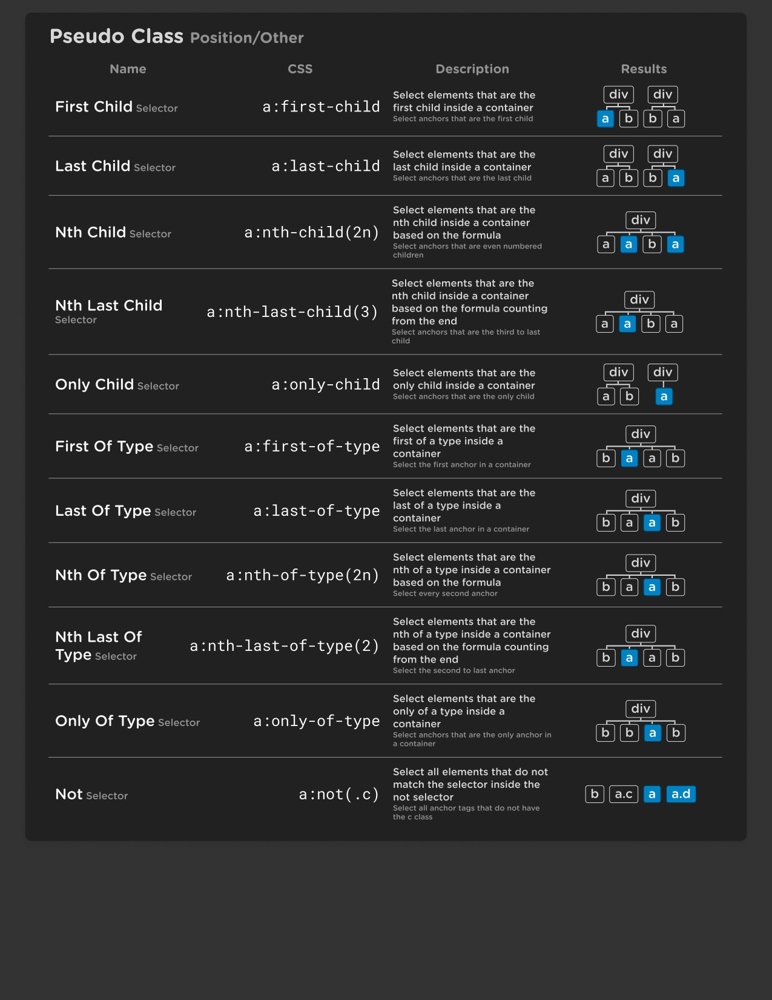
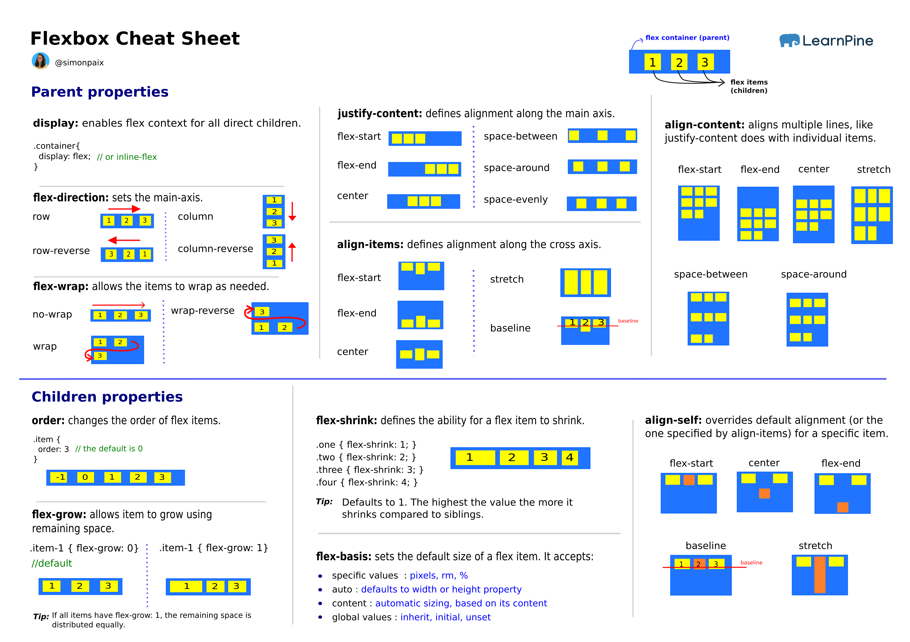

# CSS Notes

## CSS Basics

- `CSS (Cascading Style Sheets)`
- used to style and visually format HTML content on web pages.
- controls layout, colors, fonts, spacing, animations, responsiveness, and more.
- `Syntax:` Selector { property: value; }

```css
p {
  color: red;
}
```

---

## CSS Comments

- used to `add explanatory notes` in the CSS code.

```css
/* This is a comment */
```

---

## How to Add CSS

1. `Inline:` `style="property: value;"` - Adds styles directly to an HTML element.

```html
<p style="color: red;">Hello, World!</p>
```

2. `Internal:` `<style>` tag in `<head>` - Styles apply to the entire document.

```html
<style>
  p {
    color: green;
  }
</style>
```

3. `External:` Linked `.css` file using `<link>` - Preferred method for reusability.

```html
<link rel="stylesheet" href="styles.css" />
```

---

## CSS Specificity

- Determines `which rule applies when multiple rules match` the same element.
- `Order of importance:`

```
Inline > ID Selector > Class/Attribute/Pseudo-Class > Element/Pseudo-Element.
```

- `Example:` Inline (1000), ID (100), Class (10), Element (1).

---

## CSS Selectors

- Used to `select elements` to apply styles.





---

### Logical & Relational Pseudo-Classes

### ✅ `:not(selector)`

- Excludes specific elements from selection

```css
button:not(.primary) {
  background: gray;
}
```

---

### ✅ `:is(selector1, selector2, …)`

- Groups multiple selectors (affects specificity)

```css
:is(h1, h2, h3) {
  font-family: "Montserrat", sans-serif;
}
```

✅ Helps you `DRY` out large grouped selectors.

---

### ✅ `:where(selector1, selector2, …)`

- Like `:is()` but has `0 specificity`

```css
:where(article, section) p {
  line-height: 1.6;
}
```

Great for `utility-first CSS` frameworks.

---

### ✅ `:has(selector)` (🔬 Advanced — Only in modern browsers)

- Parent selector — applies style `if child exists`

```css
.card:has(img) {
  border: 1px solid green;
}
```

```css
form:has(:invalid) {
  outline: 2px solid red;
}
```

- Supported in Chrome, Edge, Safari (not Firefox yet).

---

### Combining Selectors

```css
input[type="checkbox"]:checked + label {
  font-weight: bold;
}
```

```css
.card:not(:has(img)) {
  padding-top: 2rem;
}
```

---

## 🧾 Cheatsheet Summary

```css
/* Logical */
:is(h1, h2, h3) {
}
:where(.box, .card) {
}
:not(.disabled) {
}
:has(input:focus) {
}

/* Structural */
li:first-child {
}
div:nth-of-type(2n) {
}
p:empty {
}

/* State */
a:hover {
}
input:checked {
}
button:disabled {
}

/* Attributes */
input[type="text"] {
}
a[href^="https://"]
{
}
```

---

## ⚠️ Specificity Tips

| Selector   | Specificity                      |
| ---------- | -------------------------------- |
| `element`  | 0-0-1                            |
| `.class`   | 0-1-0                            |
| `#id`      | 1-0-0                            |
| `:is()`    | Takes highest specificity inside |
| `:where()` | Always 0                         |

---

## 🧪 Browser Support (as of 2025)

| Feature    | Chrome | Safari | Firefox | Edge |
| ---------- | ------ | ------ | ------- | ---- |
| `:is()`    | ✅     | ✅     | ✅      | ✅   |
| `:where()` | ✅     | ✅     | ✅      | ✅   |
| `:not()`   | ✅     | ✅     | ✅      | ✅   |
| `:has()`   | ✅     | ✅     | ❌      | ✅   |

---

## ✅ Real-World Use Cases

- `Avoid writing multiple selectors`:

  ```css
  :is(button, a, input[type="submit"]) {
    padding: 0.75rem;
  }
  ```

- `Theme toggling`:

  ```css
  html:has(.dark-mode) {
    background-color: #121212;
  }
  ```

- `Selective form validation`:

  ```css
  form:has(:invalid) .submit {
    background: red;
  }
  ```

---

## CSS Pseudo-Class

- targets an element based on its `state, position, or characteristics` — but `without modifying the DOM`.

> Think: "Which element?" (based on a condition)

### 🔹 Syntax:

```css
selector:pseudo-class {
  /* styles */
}
```

### ✅ Examples:

```css
a:hover {
  color: red; /* When user hovers */
}

li:first-child {
  font-weight: bold; /* First <li> only */
}

input:checked {
  border: 2px solid green; /* Checked checkboxes/radios */
}
```

### 📌 Common Pseudo-Classes:

| Pseudo-Class    | Meaning                        |
| --------------- | ------------------------------ |
| `:hover`        | When mouse is over an element  |
| `:focus`        | When element is focused        |
| `:active`       | While element is being clicked |
| `:checked`      | For checkboxes/radio inputs    |
| `:disabled`     | Disabled inputs/buttons        |
| `:first-child`  | First child of a parent        |
| `:nth-child(3)` | 3rd child element              |
| `:not()`        | Excludes matching elements     |

---

## CSS Pseudo-Element?

- targets `a specific part` of an element — like the first letter, line, or adds content `before/after` it.

> Think: "Which `part` of this element?"

### 🔹 Syntax:

```css
selector::pseudo-element {
  /* styles */
}
```

> ⚠️ Uses `double colons `::``, unlike pseudo-classes.

### ✅ Examples:

```css
p::first-line {
  text-transform: uppercase;
}

h1::before {
  content: "🔹 ";
}

input::placeholder {
  color: gray;
}
```

### 📌 Common Pseudo-Elements:

| Pseudo-Element   | Meaning                             |
| ---------------- | ----------------------------------- |
| `::before`       | Adds content `before` element       |
| `::after`        | Adds content `after` element        |
| `::first-line`   | Targets the `first line` of text    |
| `::first-letter` | Targets the `first character`       |
| `::placeholder`  | Styles the placeholder of inputs    |
| `::selection`    | Styles text when user highlights it |

---

### 🧠 Key Differences

| Feature       | Pseudo-Class (`:focus`)         | Pseudo-Element (`::before`) |
| ------------- | ------------------------------- | --------------------------- |
| Targets       | Entire element (based on state) | Part of the element         |
| Uses colon    | Single `:`                      | Double `::`                 |
| DOM presence  | Doesn't add content             | Can insert content          |
| Interactivity | Often interactive               | Mostly decorative           |

---

### 👀 Visual Example

```html
<a href="#">Click Me</a>
```

```css
/* Pseudo-class */
a:hover {
  color: red; /* When hovered */
}

/* Pseudo-element */
a::after {
  content: " ➤"; /* Adds after the link */
}
```

---

### ✅ Use Together

```css
button:hover::after {
  content: " ✅";
}
```

- `:hover` → when user hovers
- `::after` → adds a checkmark

---

### 🧾 Summary

| Selector Type  | Prefix | Targets                   | Example                      |
| -------------- | ------ | ------------------------- | ---------------------------- |
| Pseudo-Class   | `:`    | Element's `state` or role | `:hover`, `:first-child`     |
| Pseudo-Element | `::`   | `Part` of the element     | `::before`, `::first-letter` |

---

## CSS Colors

- Define the color of elements using different formats.
- `Formats:` `name`, `hex (#rrggbb)`, `rgb(r,g,b)`, `rgba(r,g,b,a)`.

```css
color: rgba(255, 0, 0, 0.5);
```

---

## CSS Background

- Set background styles for elements.
- `Properties:` `background-color`, `background-image`, `background-repeat`, `background-position`, `background-size`.

```css
background-image: url("image.jpg");
background-size: cover;
```

---

## CSS Gradient

### Linear Gradient

- Creates a `gradual transition` between `colors along a straight line.`
- `background: linear-gradient(direction, color1, color2, ...);`

```css
background: linear-gradient(to right, red 30%, blue 70%);
```

### Radial Gradient

- Creates a `gradual transition` between `colors radiating from a central point`.
- `background: radial-gradient(shape size at position, color1, color2, ...);`

```css
background: radial-gradient(circle, red, yellow, blue);
```

---

## Border CSS

- Define the border around elements.
- `Properties:` `border`, `border-width`, `border-style`, `border-color`.

```css
border: 1px solid black;
```

---

## Text CSS

- Style the text within elements.
- `Properties:` `color`, `text-align`, `text-decoration`, `line-height`, `letter-spacing`.

```css
text-align: center;
line-height: 1.5;
```

---

## Fonts CSS

- Set the font styles for text.
- `Properties:` `font-family`, `font-size`, `font-weight`, `font-style`.

```css
font-family: Arial, sans-serif;
font-size: 16px;
```

---

## Height and Width CSS

- Define dimensions of elements.
- `Properties:` `height`, `width`, `max-width`, `min-height`.

```css
height: 100px;
width: 50%;
```

---

## Box Model?

Every HTML element is treated as a `box`, and the `CSS Box Model` defines how that box is structured in terms of:

### 🔍 Visualization (text version)

```
┌───────────────────────────────────────────────┐← Margin
│ ┌───────────────────────────────────────────┐←--- Border
│ │ ┌───────────────────────────────────────┐←----- Padding
│ │ │       📝 Content (text, image, etc.) │ │ │
│ │ └───────────────────────────────────────┘ │ │
│ └───────────────────────────────────────────┘ │
└───────────────────────────────────────────────┘
```

---

### 🧮 Box Model Properties

| Property  | Description                          |
| --------- | ------------------------------------ |
| `margin`  | Space `outside` the element's border |
| `border`  | Thickness and style of the edge      |
| `padding` | Space `inside` the box               |
| `width`   | Width of the content area            |
| `height`  | Height of the content area           |

---

### 📘 Default `box-sizing`

### 🔹 `box-sizing: content-box` (default)

```css
width: 200px;
padding: 20px;
border: 10px;
```

👉 Actual rendered width:

```
200 (content) + 40 (padding) + 20 (border) = 260px
```

---

### 🔹 `box-sizing: border-box` ✅ (recommended)

> Total size = width (including padding + border)

```css
box-sizing: border-box;
width: 200px;
padding: 20px;
border: 10px;
```

👉 Total width remains `200px` — content is auto-adjusted.

---

### 🛠️ Universal Reset

To avoid box model inconsistencies across browsers:

```css
*,
*::before,
*::after {
  box-sizing: border-box;
}
```

---

### 📏 Example

```css
.box {
  width: 300px;
  padding: 20px;
  border: 5px solid black;
  margin: 10px;
}
```

- `Content width` = 300px (default if `content-box`)
- `Total width` = 300 + 40 (padding) + 10 (border) = 350px

---

### ✅ Best Practices

- Always use `box-sizing: border-box;` to prevent layout surprises.
- Use `padding` for spacing `inside` an element.
- Use `margin` for spacing `between` elements.
- Set `display: inline-block` or `flex` to control box flow.

---

## CSS Margin Collapsing

- is a CSS behavior where `vertical margins of adjacent elements` combine into `a single margin`, rather than adding up.

---

### 📌 When Does Margin Collapsing Happen?

#### ✅ 1. `Between vertical siblings`

```html
<div class="box1"></div>
<div class="box2"></div>
```

```css
.box1 {
  margin-bottom: 20px;
}
.box2 {
  margin-top: 30px;
}
```

➡️ Result: The space between the two elements is `30px`, `not 50px`.
Because `20px` and `30px` collapse to `the larger value`.

---

#### ✅ 2. `Between parent and first/last child`

```html
<div class="parent">
  <div class="child"></div>
</div>
```

```css
.parent {
  margin-top: 50px;
}
.child {
  margin-top: 30px;
}
```

➡️ Result: The `30px` top margin of the child `collapses` with the parent’s margin. The total top space is `max(30, 50) = 50px`, not 80px.

---

#### ✅ 3. `Empty elements with no padding/border/content`

```html
<div class="empty"></div>
```

```css
.empty {
  margin-top: 20px;
  margin-bottom: 30px;
}
```

➡️ If this element has no `padding`, `border`, or `content`, the `top and bottom margins collapse` into `30px`, the larger one.

---

### 🧪 Margin Collapsing _Only_ Applies To:

- `Vertical margins`
- `Block-level elements` (like `div`, `p`, `section`, etc.)
- Elements in the `normal document flow` (not floated or absolutely positioned)

---

## Box and Text Shadow

- Add shadows to boxes or text.
- `Box-Shadow:` `box-shadow: x-offset y-offset blur-radius color;`
- `Text-Shadow:` `text-shadow: x-offset y-offset blur-radius color;`

```css
box-shadow: 2px 2px 5px gray;
text-shadow: 1px 1px 2px black;`
```

---

## CSS Units

- define `how sizes (like width, padding, font-size, etc.) are measured`.
- There are two main types:

### 🔸 1. `Absolute Units` (Fixed Size)

These units are `not affected` by parent or screen size. They're best for print or when pixel-perfect precision is needed.

| Unit | Full Form   | Relative To          | Notes                                                       |
| ---- | ----------- | -------------------- | ----------------------------------------------------------- |
| `px` | pixels      | Screen pixels        | Most common unit. 1px = 1 device pixel on standard screens. |
| `pt` | point       | 1/72 of an inch      | Mostly used in print stylesheets.                           |
| `pc` | pica        | 12 points (1/6 inch) | Used in print design.                                       |
| `in` | inch        | 2.54 cm              | Rarely used in web.                                         |
| `cm` | centimeters | Physical cm          | Not practical for responsive design.                        |
| `mm` | millimeters | Physical mm          | Also rare in web design.                                    |

🧠 `Use Case for `px`:` UI layout spacing, borders, font-size (when you need precision).

---

### 🔹 2. `Relative Units` (Flexible / Responsive)

Relative units `adapt to context`, such as parent size or user settings (accessibility). These are preferred for `responsive design`.

#### ✅ Font-relative Units:

| Unit  | Relative To                         | Use Case                             |
| ----- | ----------------------------------- | ------------------------------------ |
| `em`  | Parent element’s font size          | Nested font sizing, padding, spacing |
| `rem` | Root element’s font size (`<html>`) | Consistent sizing across app         |
| `%`   | Parent’s size                       | Widths, paddings, font-sizes         |
| `ex`  | x-height of the font                | Rarely used                          |
| `ch`  | Width of `0` character              | Fixed-width designs, inputs          |

#### 🔁 Viewport-relative Units:

| Unit   | Relative To               | Use Case                             |
| ------ | ------------------------- | ------------------------------------ |
| `vw`   | 1% of viewport width      | Fluid typography, responsive layouts |
| `vh`   | 1% of viewport height     | Full-screen sections                 |
| `vmin` | 1% of smaller of vw or vh | Maintain layout aspect ratio         |
| `vmax` | 1% of larger of vw or vh  | Maintain max-fit in container        |

#### ⏱ Newer Units (L3+):

| Unit         | Description                                                                |
| ------------ | -------------------------------------------------------------------------- |
| `lvw`, `lvh` | Large viewport width/height (ignores overlays)                             |
| `svw`, `svh` | Small viewport width/height (accounts for overlays like mobile browser UI) |
| `dvw`, `dvh` | Dynamic viewport width/height (updates on resize)                          |

> ✅ Use `dvh` instead of `100vh` to avoid mobile issues like address bars cutting off content.

---

## 🆚 em vs rem

```css
html {
  font-size: 16px;
}

.container {
  font-size: 1.5rem; /* 24px (16 * 1.5) */
  padding: 2em; /* 48px (24 * 2) */
}
```

| Unit  | Depends on         | Good For                  |
| ----- | ------------------ | ------------------------- |
| `em`  | Parent's font-size | Component-local scaling   |
| `rem` | Root font-size     | Consistent global scaling |

---

### 🧠 When to Use What

| Use Case                 | Recommended Unit  |
| ------------------------ | ----------------- |
| Font size                | `rem`, `em`       |
| Spacing (margin/padding) | `rem`, `em`, `%`  |
| Widths/heights           | `%`, `vw`, `vh`   |
| Fixed icons, borders     | `px`              |
| Responsive layout        | `vw`, `vh`, `rem` |

---

### 💡 Bonus: Fluid Typography Trick

```css
html {
  font-size: clamp(1rem, 2vw + 1rem, 2.5rem);
}
```

This sets font size to:

- Minimum: 1rem
- Ideal: scales with 2vw + 1rem
- Max: 2.5rem

✅ Perfect for making fonts `responsive but bounded`.

---

### 🧪 Real Example

```css
:root {
  --spacing: 2rem;
}

.container {
  padding: var(--spacing);
  font-size: 1rem;
  max-width: 90vw;
}
```

---

## CSS Outline

- Line drawn around an element, outside the border, without affecting layout.

```css
outline: 2px dotted red;
```

---

## CSS Links

- Style different link states.
- `States:` `a:link`, `a:visited`, `a:hover`, `a:active`.

```css
a:hover {
  color: green;
}
```

---

## CSS List

- Style list elements.
- `Properties:` `list-style-type`, `list-style-image`, `list-style-position`.

```css
list-style-type: circle;
```

---

## CSS Table

- Style table elements.
- `Properties:` `border-collapse`, `border-spacing`, `caption-side`.

```css
table {
  border-collapse: collapse;
}
```

---

## CSS Position

The `position` property determines how an element is positioned in the document flow and how it responds to the top, right, bottom, and left properties.

---

### 🧱 All Position Values

| Value      | Description                                                                                                                                                  |
| ---------- | ------------------------------------------------------------------------------------------------------------------------------------------------------------ |
| `static`   | Default. Element follows the normal flow of the document. `top`, `right`, etc. have no effect.                                                               |
| `relative` | Positions the element relative to its normal position. Doesn't remove it from the document flow.                                                             |
| `absolute` | Positions the element relative to the `nearest positioned ancestor` (`relative`, `absolute`, or `fixed`). If none, it's relative to the `<html>` (viewport). |
| `fixed`    | Positions the element relative to the `viewport`. Stays fixed on scroll.                                                                                     |
| `sticky`   | Acts like `relative` until a threshold is crossed (e.g., scroll), then becomes `fixed`. Requires `top`, `bottom`, etc.                                       |

---

### ⚙️ How Each Works (with Real-World Use)

---

#### 1. ✅ `static` (Default)

```css
div {
  position: static;
}
```

- No special positioning.
- Can’t use `top`, `left`, etc.
- Follows normal document flow.

🧠 `Use case:` Standard content like paragraphs, headings.

---

#### 2. 🔁 `relative`

```css
div {
  position: relative;
  top: 10px;
  left: 20px;
}
```

- Shifts `relative to its original position`.
- Does `not` affect surrounding elements' layout.

🧠 `Use case:` Add small tweaks, tooltip triggers, or set up a context for `absolute` children.

---

#### 3. 🎯 `absolute`

```css
.container {
  position: relative;
}

.box {
  position: absolute;
  top: 0;
  right: 0;
}
```

- Out of document flow.
- Positioned relative to the `nearest positioned ancestor`.
- If no ancestor is positioned, it uses the `html` element.

🧠 `Use case:` Dropdowns, tooltips, modals, floating icons.

---

#### 4. 📌 `fixed`

```css
.navbar {
  position: fixed;
  top: 0;
  left: 0;
  width: 100%;
}
```

- Fixed to `viewport`.
- Does not move on scroll.

🧠 `Use case:` Sticky headers, floating action buttons, side navs.

---

#### 5. 📍 `sticky`

```css
.sidebar {
  position: sticky;
  top: 0;
}
```

- Hybrid of `relative` + `fixed`.
- Scrolls with content until a `threshold` (e.g., `top: 0`) is reached.
- Works only inside a scrollable container.

🧠 `Use case:` Sticky headings in tables, scrollspy sections, persistent navs.

---

### 📊 Visual Tree Representation

```
html
└── body
    └── div (static)
        ├── span (relative)
        │   └── tooltip (absolute → positioned to span)
        └── header (sticky → scrolls till top)
    └── nav (fixed → stays on screen)
```

---

### 🧱 Stack Order & `z-index`

- Only elements with `position` values of `relative`, `absolute`, `fixed`, or `sticky` create a `stacking context` with `z-index`.
- `z-index` works `only` on positioned elements.

```css
.box1 {
  position: absolute;
  z-index: 10;
}

.box2 {
  position: absolute;
  z-index: 5;
}
```

🧠 Higher `z-index` means closer to the viewer (on top).

---

### 🪟 Real World Examples

#### ✅ Tooltip:

```css
.tooltip-container {
  position: relative;
}

.tooltip {
  position: absolute;
  top: 100%;
  left: 0;
}
```

#### ✅ Fixed Navbar:

```css
.navbar {
  position: fixed;
  top: 0;
  width: 100%;
  z-index: 1000;
}
```

#### ✅ Scroll Sticky Header:

```css
.header {
  position: sticky;
  top: 0;
  background: white;
  z-index: 1;
}
```

---

### 🚫 Common Mistakes

1. `Using `top`, `left`with`static`:` No effect.
2. `No `positioned`parent for`absolute`:` It’ll attach to `<html>`, not expected container.
3. ``sticky` not working?`

   - Missing `top`, `bottom`, etc.
   - Parent has `overflow: hidden/scroll/auto`.

---

### 📌 Position Summary Table

| Position   | Affects Layout | Relative to       | Removed from Flow | Scroll Affected | Use Case             |
| ---------- | -------------- | ----------------- | ----------------- | --------------- | -------------------- |
| `static`   | ✅             | Normal flow       | ❌                | ✅              | Default layout       |
| `relative` | ✅ (minor)     | Self              | ❌                | ✅              | Nudging, anchor      |
| `absolute` | ❌             | Positioned parent | ✅                | ✅              | Tooltips, modals     |
| `fixed`    | ❌             | Viewport          | ✅                | ❌              | Navbars, FABs        |
| `sticky`   | ✅ (initial)   | Self until sticky | ❌                | ⛔ (partially)  | Section headers, TOC |

---

## CSS Overflow

- Specify how content that overflows the container is handled.
- `Values:` `visible`, `hidden`, `scroll`, `auto`.

```css
overflow: auto;
```

---

## CSS Media Query

Media Queries let you apply CSS `only when specific conditions` (like screen width, resolution, orientation) are met.

> `"If the screen is less than 768px wide, apply these styles."`

---

### 🔤 Basic Syntax

```css
@media media-type and (condition) {
  /* CSS rules go here */
}
```

### ✅ Example:

```css
@media screen and (max-width: 768px) {
  body {
    background-color: lightblue;
  }
}
```

---

### 📦 Media Types

| Media Type | Description                     |
| ---------- | ------------------------------- |
| `all`      | Default, applies to all devices |
| `screen`   | Screens (phones, laptops)       |
| `print`    | Print preview or printed docs   |
| `speech`   | Screen readers                  |

---

### 📐 Common Media Features

| Feature            | Description                | Example                  |
| ------------------ | -------------------------- | ------------------------ |
| `width` / `height` | Viewport width/height      | `max-width: 768px`       |
| `orientation`      | Landscape or portrait      | `orientation: portrait`  |
| `aspect-ratio`     | Ratio of width to height   | `aspect-ratio: 16/9`     |
| `resolution`       | DPI or DPCM of screen      | `min-resolution: 300dpi` |
| `hover`            | Whether hover is supported | `hover: none`            |
| `pointer`          | Precision of input pointer | `pointer: coarse`        |

---

### 🔁 Min vs Max

| Property    | Meaning                                 |
| ----------- | --------------------------------------- |
| `min-width` | Apply if screen is `at least` this wide |
| `max-width` | Apply if screen is `at most` this wide  |

### 📌 Rule of Thumb:

- Use `min-width` for `mobile-first` design
- Use `max-width` for `desktop-first`

---

### 📱 Common Breakpoints

| Device       | Width Range      |
| ------------ | ---------------- |
| Mobile       | 320px – 480px    |
| Tablet       | 481px – 768px    |
| Small Laptop | 769px – 1024px   |
| Desktop      | 1025px and above |

```css
/* Mobile-first approach */
@media (min-width: 480px) {
  ...;
}
@media (min-width: 768px) {
  ...;
}
@media (min-width: 1024px) {
  ...;
}
```

---

### 💡 Media Query Examples

### ✅ Responsive Layout

```css
.container {
  display: flex;
  flex-direction: column;
}
@media (min-width: 768px) {
  .container {
    flex-direction: row;
  }
}
```

### ✅ Hide an element on mobile

```css
@media (max-width: 600px) {
  .sidebar {
    display: none;
  }
}
```

### ✅ Print Styles

```css
@media print {
  body {
    font-size: 12pt;
    color: black;
  }
}
```

---

### 🔀 Combining Conditions

```css
@media screen and (min-width: 768px) and (orientation: landscape) {
  /* Apply if width ≥ 768px AND landscape */
}
```

---

### ⚡ Advanced: Media Query Ranges (CSS Level 4+)

```css
@media (400px <= width <= 768px) {
  /* Apply styles between 400px and 768px */
}
```

Note: Not supported in all browsers yet. Use with caution.

---

### 📌 Best Practices

1. ✅ `Mobile-first approach`: Start with base styles for mobile, use `min-width` to enhance for bigger screens.
2. ✅ `Group breakpoints logically` (desktop/tablet/mobile).
3. ❌ Avoid too many breakpoints. Use `fluid units (%, rem, vw)` where possible.
4. ✅ Keep breakpoints consistent across your app.

---

### 📁 Organizing Media Queries

### Option 1: Inline (with components)

```css
.card {
  padding: 1rem;
}
@media (min-width: 768px) {
  .card {
    padding: 2rem;
  }
}
```

### Option 2: Centralized in a file

```css
/* styles.css */
@media (min-width: 768px) {
  /* All tablet+ overrides */
}
```

---

### 🧪 Real Example: Fluid Grid

```css
.grid {
  display: grid;
  grid-template-columns: 1fr;
}
@media (min-width: 768px) {
  .grid {
    grid-template-columns: 1fr 1fr;
  }
}
@media (min-width: 1024px) {
  .grid {
    grid-template-columns: 1fr 1fr 1fr;
  }
}
```

---

### 🧾 Media Query Cheatsheet

```css
/* Portrait phones */
@media (max-width: 480px) {
  ...;
}

/* Landscape phones */
@media (min-width: 481px) and (max-width: 767px) {
  ...;
}

/* Tablets */
@media (min-width: 768px) and (max-width: 1023px) {
  ...;
}

/* Laptops & desktops */
@media (min-width: 1024px) {
  ...;
}
```

---

## CSS Transitions

### ✅ Used to animate changes from one state to another (e.g., hover, click).

### 🔹 Syntax:

```css
transition: property duration timing-function delay;
```

### 🔹 Example:

```css
.button {
  background: blue;
  transition: background 0.3s ease-in-out;
}

.button:hover {
  background: green;
}
```

### 🔹 Common Properties:

| Property                     | Description                                                           |
| ---------------------------- | --------------------------------------------------------------------- |
| `transition-property`        | What you want to animate (e.g., `all`, `opacity`, `transform`)        |
| `transition-duration`        | How long it takes (e.g., `0.5s`, `300ms`)                             |
| `transition-timing-function` | Speed curve (`ease`, `linear`, `ease-in`, `ease-out`, `cubic-bezier`) |
| `transition-delay`           | Wait time before starting                                             |

---

## CSS Animations

### ✅ Used for more complex, continuous, or multi-step animations.

### 🔹 Requires:

- `@keyframes` rule to define the animation
- `animation` properties to run it

### 🔹 Example:

```css
@keyframes bounce {
  0% {
    transform: translateY(0);
  }
  50% {
    transform: translateY(-30px);
  }
  100% {
    transform: translateY(0);
  }
}

.ball {
  animation: bounce 1s ease infinite;
}
```

---

### 🔹 Animation Properties:

| Property                    | Purpose                                               |
| --------------------------- | ----------------------------------------------------- |
| `animation-name`            | Name of the `@keyframes`                              |
| `animation-duration`        | How long the animation takes                          |
| `animation-timing-function` | Speed curve                                           |
| `animation-delay`           | Delay before it starts                                |
| `animation-iteration-count` | How many times (`1`, `infinite`)                      |
| `animation-direction`       | `normal`, `reverse`, `alternate`, `alternate-reverse` |
| `animation-fill-mode`       | `none`, `forwards`, `backwards`, `both`               |
| `animation-play-state`      | `running`, `paused`                                   |

---

### 🆚 Transition vs Animation

| Feature | `transition`                              | `animation`                           |
| ------- | ----------------------------------------- | ------------------------------------- |
| Trigger | Requires interaction (hover, focus, etc.) | Can run automatically                 |
| Steps   | One step (start → end)                    | Multiple steps (keyframes)            |
| Repeats | No                                        | Yes (`infinite`)                      |
| Delay   | Yes                                       | Yes                                   |
| Control | Less control                              | Full control (pause, direction, etc.) |

---

### 💡 Tips

- Use `transform` and `opacity` for performance-friendly animations.
- Avoid animating `width`, `height`, `top`, `left` if possible (they trigger layout recalculations).
- `cubic-bezier()` gives you custom timing for advanced easing.

---

### 🧪 Real-Life Example: Button with Bounce on Hover

```css
@keyframes bounceIn {
  0% {
    transform: scale(0.9);
    opacity: 0;
  }
  60% {
    transform: scale(1.1);
    opacity: 1;
  }
  100% {
    transform: scale(1);
  }
}

.button {
  animation: bounceIn 0.5s ease;
  transition: transform 0.3s;
}

.button:hover {
  transform: scale(1.1);
}
```

---

## CSS Display

The `display` property defines how an element is `visually formatted` in the document flow.

### 🔸 Common Values (Without Flex/Grid):

| Value                              | Description                                                          |
| ---------------------------------- | -------------------------------------------------------------------- |
| `block`                            | Takes full width, starts on a new line (e.g., `div`, `h1`)           |
| `inline`                           | Takes only the content width, doesn’t break line (e.g., `span`, `a`) |
| `inline-block`                     | Like `inline`, but allows setting `width`, `height`, `margin`, etc.  |
| `none`                             | Completely hides the element (no space reserved)                     |
| `table`, `table-row`, `table-cell` | Makes elements behave like a table (used before Grid)                |

---

### ✅ A. `Inline and Inline-block`

```css
.item {
  display: inline-block;
  width: 100px;
  height: 100px;
}
```

- Elements flow horizontally
- You can set dimensions
- Respect white space between elements (use `font-size: 0` on parent to remove gaps)

---

### ✅ B. `Float-based Layouts`

```css
.left {
  float: left;
  width: 50%;
}
.right {
  float: right;
  width: 50%;
}
```

- Elements are pulled left/right
- Content flows around them
- Requires `clearfix` technique to contain floated children:

```css
.clearfix::after {
  content: "";
  display: table;
  clear: both;
}
```

⚠️ Can cause layout bugs — not responsive-friendly.

---

### ✅ C. `Table Display`

```css
.container {
  display: table;
  width: 100%;
}
.row {
  display: table-row;
}
.cell {
  display: table-cell;
  padding: 10px;
}
```

- Mimics HTML tables
- Used for vertical centering and fixed-width columns

---

### Margin Auto for Centering

```css
.box {
  width: 200px;
  margin: 0 auto;
}
```

✅ Horizontally centers block elements with fixed width.

---

### Vertical Alignment (Legacy)

Inside `inline-block` or `table-cell`:

```css
.parent {
  display: table-cell;
  vertical-align: middle;
}
```

---

### Overflow and Visibility

- `overflow: hidden | scroll | auto`
- `visibility: hidden` vs `display: none`

```css
.box {
  overflow: auto;
  max-height: 300px;
}
```

---

### 🧠 Summary Table

| Feature           | Techniques                                |
| ----------------- | ----------------------------------------- |
| Horizontal layout | `inline-block`, `float`                   |
| Vertical layout   | `table-cell`, `position`                  |
| Centering         | `margin: auto`, `text-align`, `transform` |
| Hiding            | `display: none`, `visibility: hidden`     |
| Overflows         | `overflow` property                       |
| Custom layout     | `position: absolute` or `relative`        |

---

### 🧪 Real-Life Use

Before Flexbox/Grid, developers built:

- 3-column layouts using floats
- Centered boxes using `margin: auto`
- Sticky headers using `position: sticky`
- Menus with `inline-block`

---

### CSS Flexbox?

`Flexbox` (Flexible Box Layout) is a `1-dimensional layout model` in CSS that lets you design layouts `along a single axis`: either `row (horizontal)` or `column (vertical)`.

> Perfect for toolbars, cards, navbars, modals, and alignment tasks.

---

### ✅ Flexbox Syntax

```css
.container {
  display: flex; /* or inline-flex */
}
```

Everything else (child alignment, spacing, etc.) is defined via `flex properties`.

---

### 🧱 Flex Container vs Flex Items

- `Flex Container`: Element with `display: flex`
- `Flex Items`: Direct children of the container

```html
<div class="container">
  <div>Item 1</div>
  <div>Item 2</div>
</div>
```

---

### 🔁 Flex Direction

```css
flex-direction: row; /* default */
flex-direction: row-reverse;
flex-direction: column;
flex-direction: column-reverse;
```

➡️ Defines the `main axis` (horizontal or vertical)
➡️ The cross axis is `perpendicular` to the main axis

---

### 🌐 Main Properties

### 🔸 `justify-content` (main axis alignment)

Aligns items `along the main axis`:

```css
justify-content: flex-start; /* default */
justify-content: flex-end;
justify-content: center;
justify-content: space-between;
justify-content: space-around;
justify-content: space-evenly;
```

---

### 🔸 `align-items` (cross axis alignment)

Aligns items `along the cross axis`:

```css
align-items: stretch; /* default */
align-items: flex-start;
align-items: flex-end;
align-items: center;
align-items: baseline;
```

---

### 🔸 `align-content` (multi-line cross axis alignment)

Used `only when items wrap` to multiple lines:

```css
align-content: stretch; /* default */
align-content: flex-start;
align-content: flex-end;
align-content: center;
align-content: space-between;
```

---

### 🔄 Wrapping Items

```css
flex-wrap: nowrap; /* default */
flex-wrap: wrap;
flex-wrap: wrap-reverse;
```

Can also be combined as shorthand:

```css
flex-flow: row wrap;
```

---

### 🔹 Flex Item Properties

### 1. `flex-grow`

```css
.item {
  flex-grow: 1; /* take up available space */
}
```

Defines how much a flex item `grows` relative to others.

---

### 2. `flex-shrink`

```css
.item {
  flex-shrink: 1; /* default */
}
```

Defines how much a flex item `shrinks` when needed.

---

### 3. `flex-basis`

```css
.item {
  flex-basis: 200px; /* preferred size before growing/shrinking */
}
```

---

### 🔀 Shorthand

```css
.item {
  flex: 1 0 200px;
  /* grow shrink basis */
}
```

Common shortcuts:

- `flex: 1` → `1 1 0`
- `flex: auto` → `1 1 auto`
- `flex: none` → `0 0 auto`

---

### 🔁 `align-self`

Override `align-items` `per item`:

```css
.item {
  align-self: center;
}
```

---

### 📦 `order`

Change the order of flex items (without changing DOM):

```css
.item {
  order: 2; /* default is 0 */
}
```

---

### 📏 Real-World Example

```css
.navbar {
  display: flex;
  justify-content: space-between;
  align-items: center;
}
```

```html
<div class="navbar">
  <div class="logo">Logo</div>
  <ul class="menu">
    <li>Home</li>
    <li>About</li>
  </ul>
</div>
```

---

### 🪄 Responsive Flexbox Cards

```css
.card-container {
  display: flex;
  flex-wrap: wrap;
  gap: 1rem;
}
.card {
  flex: 1 1 calc(33.33% - 1rem);
}
@media (max-width: 768px) {
  .card {
    flex: 1 1 100%;
  }
}
```

---

### 🎯 Common Layouts with Flexbox

### ✅ Centering:

```css
.center {
  display: flex;
  justify-content: center;
  align-items: center;
}
```

### ✅ Equal width columns:

```css
.col {
  flex: 1;
}
```

### ✅ Responsive navbar:

```css
.nav {
  display: flex;
  justify-content: space-between;
}
```

---

### 🧾 Flexbox Cheatsheet

```css
.container {
  display: flex;
  flex-direction: row | column;
  justify-content: center | space-between;
  align-items: center | stretch;
  flex-wrap: wrap;
}

.item {
  flex: 1 0 200px;
  align-self: flex-end;
  order: 2;
}
```

## 

---

## CSS Grid?

`CSS Grid` is a 2-dimensional layout system in CSS that allows you to layout items in `rows and columns`, making it perfect for `complex responsive designs`.

> Unlike Flexbox (1D), `Grid handles both rows & columns simultaneously`.

---

### 🧱 Basic Terminology

| Term             | Meaning                                         |
| ---------------- | ----------------------------------------------- |
| `Grid Container` | Element with `display: grid` or `inline-grid`   |
| `Grid Item`      | Direct children of the grid container           |
| `Grid Line`      | Invisible lines dividing rows and columns       |
| `Grid Track`     | Space between two lines (i.e., a column or row) |
| `Grid Cell`      | Intersection of a row and column                |
| `Grid Area`      | A rectangular space covering multiple cells     |

---

### 🚀 Getting Started

```css
.container {
  display: grid;
  grid-template-columns: 1fr 2fr;
  grid-template-rows: auto auto;
}
```

```html
<div class="container">
  <div>1</div>
  <div>2</div>
  <div>3</div>
</div>
```

- Creates a 2-column grid: 1 fraction and 2 fractions
- Two auto rows (rows grow to fit content)

---

### 🧮 Grid Units

| Unit             | Description                                  |
| ---------------- | -------------------------------------------- |
| `fr`             | Fractional unit (portion of available space) |
| `%`              | Percentage of parent                         |
| `auto`           | Size based on content                        |
| `px`, `em`, etc. | Fixed units                                  |

---

### 📐 Defining Columns and Rows

```css
grid-template-columns: 200px 1fr 2fr;
grid-template-rows: 100px auto;
```

- Explicitly defines number and size of columns/rows

---

### 🔁 Repeat Notation

```css
grid-template-columns: repeat(3, 1fr);
```

➡️ Same as: `1fr 1fr 1fr`

---

### 🔄 Auto-fill vs Auto-fit

```css
grid-template-columns: repeat(auto-fill, minmax(200px, 1fr));
```

| Keyword     | Description                                               |
| ----------- | --------------------------------------------------------- |
| `auto-fill` | Fills row with as many columns as possible, even if empty |
| `auto-fit`  | Collapses empty columns                                   |

Use with `minmax()` for responsive grids.

---

### 🧭 Placing Items

#### Explicit Placement

```css
.item {
  grid-column: 2 / 4;
  grid-row: 1 / 3;
}
```

- Spans from line 2 to line 4 (columns)
- Spans from line 1 to line 3 (rows)

#### Named Line Placement

```css
grid-template-columns: [start] 1fr [middle] 1fr [end];
.item {
  grid-column: start / middle;
}
```

---

### 🔲 Grid Areas

#### Naming Areas

```css
.container {
  grid-template-areas:
    "header header"
    "sidebar main"
    "footer footer";
  grid-template-columns: 200px 1fr;
}
```

```css
.header {
  grid-area: header;
}
.sidebar {
  grid-area: sidebar;
}
.main {
  grid-area: main;
}
.footer {
  grid-area: footer;
}
```

🧠 Makes layout more readable.

---

### 🔄 Implicit Grids

When you don’t define enough rows/columns, the browser creates them automatically.

```css
grid-auto-rows: 100px;
```

---

### 📦 Gap Between Items

```css
grid-gap: 20px;
/* or */
row-gap: 10px;
column-gap: 20px;
```

---

### 🔤 Justify & Align

| Property          | Controls                    | Values                                   |
| ----------------- | --------------------------- | ---------------------------------------- |
| `justify-items`   | Horizontal item alignment   | `start`, `center`, `end`, `stretch`      |
| `align-items`     | Vertical item alignment     | Same                                     |
| `justify-content` | Grid alignment (horizontal) | `start`, `center`, `space-between`, etc. |
| `align-content`   | Grid alignment (vertical)   | Same                                     |

---

### 🔀 Order and Layering

```css
.item {
  z-index: 1; /* stack order */
  order: 2; /* order (flex only) */
}
```

You can visually move grid items using `grid-column` and `grid-row` without changing DOM order.

---

### 💡 Real-World Example: Responsive Card Grid

```css
.card-grid {
  display: grid;
  gap: 1rem;
  grid-template-columns: repeat(auto-fit, minmax(250px, 1fr));
}
```

📱 Automatically adjusts cards per screen size.

---

### 🔮 Advanced Features

#### `subgrid` (Experimental but supported in Firefox)

Allows nested grids to inherit row/column sizes from parent.

#### Grid with media queries

```css
@media (max-width: 768px) {
  .container {
    grid-template-columns: 1fr;
  }
}
```

---

### 📌 Grid vs Flexbox

| Feature        | Grid                          | Flexbox              |
| -------------- | ----------------------------- | -------------------- |
| Layout Type    | 2D (row + column)             | 1D (row `or` column) |
| Alignment      | Both axes simultaneously      | One axis at a time   |
| Item Placement | Precise (line numbers, areas) | Order-based          |
| Best For       | Full-page/layout design       | Toolbar, nav, forms  |

Use `Grid for layout`, `Flexbox for components`.

---

## ✅ Cheatsheet

```css
display: grid;
grid-template-columns: repeat(3, 1fr);
grid-template-rows: auto;
grid-gap: 20px;
grid-column: 2 / 4;
grid-row: 1 / 2;
grid-area: name;
```

## 

---

## CSS Functions?

`CSS Functions` are expressions that return a value, often used inside property values. They can perform `calculations`, `color manipulations`, `transformations`, and more.

---

### 🧮 1. `calc()` — Calculations in CSS

```css
width: calc(100% - 60px);
```

✅ Supports basic math operations: `+`, `-`, `*`, `/`
✅ Works with different units (e.g., `% + px`)

> Useful for responsive layouts, dynamic spacing.

---

### 🎨 2. `var()` — CSS Variables

```css
:root {
  --main-color: #3498db;
}

.button {
  background: var(--main-color);
}
```

✅ Allows you to reuse values and build themes.
✅ Combine with `calc()` and fallbacks:

```css
padding: var(--spacing, 10px); /* fallback = 10px */
```

---

### 🎨 3. `rgb()`, `rgba()`, `hsl()`, `hsla()` — Colors

```css
background-color: rgb(255, 99, 71);
color: rgba(0, 0, 0, 0.6); /* with alpha */
background: hsl(120, 100%, 50%);
```

✅ `rgba` and `hsla` allow transparency
✅ HSL is great for theming & light/dark manipulation

---

### 📐 4. `url()` — External resources (e.g., images, fonts)

```css
background-image: url("bg.jpg");
font-face {
  src: url("myfont.woff2");
}
```

---

### 📏 5. `min()`, `max()`, and `clamp()` — Responsive Sizing

#### ✅ `min()`: Chooses the `smaller` of two values

```css
width: min(100%, 500px);
```

#### ✅ `max()`: Chooses the `larger` of two values

```css
width: max(50vw, 300px);
```

#### ✅ `clamp(min, preferred, max)`

```css
font-size: clamp(14px, 2vw, 24px);
```

> 💡 `clamp()` is great for responsive typography.

---

### 🌈 6. `linear-gradient()` & `radial-gradient()`

```css
background: linear-gradient(to right, #00f, #0ff);
background: radial-gradient(circle, #f00, #ff0);
```

✅ Creates smooth transitions between colors
✅ Can be layered and animated

---

### 🔁 7. `repeat()` — Grid template repetition

```css
grid-template-columns: repeat(3, 1fr);
```

> 💡 Saves you from writing `1fr 1fr 1fr`

---

### 📦 8. `attr()` — Attribute-based styling (only for `content`)

```css
a::after {
  content: attr(href);
}
```

> 💡 Limited support — works mostly in `content`

---

### 🧭 9. `translate()`, `scale()`, `rotate()` — Transform functions

```css
transform: translateX(20px) scale(1.2) rotate(45deg);
```

✅ Use in animations, hover effects, or UI transitions.

---

### 🌀 10. `cubic-bezier()` — Custom timing functions

```css
transition: all 0.3s cubic-bezier(0.4, 0, 0.2, 1);
```

✅ Creates smooth animations with custom easing.

---

### 📑 Summary Table

| Function            | Purpose                     |
| ------------------- | --------------------------- |
| `calc()`            | Math with mixed units       |
| `var()`             | CSS variables               |
| `rgb()`, `hsl()`    | Color definitions           |
| `url()`             | External assets             |
| `min()`/`max()`     | Responsive sizing           |
| `clamp()`           | Min-preferred-max sizing    |
| `repeat()`          | Grid repetition             |
| `attr()`            | Pulls attribute values      |
| `linear-gradient()` | Gradient backgrounds        |
| `transform()`       | 2D/3D transformations       |
| `cubic-bezier()`    | Custom easing in animations |

---

### ⚠️ Tips

- ✅ Combine `var()` with `calc()` and `clamp()` for powerful dynamic layouts.
- 🧪 Always test cross-browser support (some features like `attr()` have limits).
- 🎯 Use `clamp()` for fluid typography and layout padding/margins.

---
