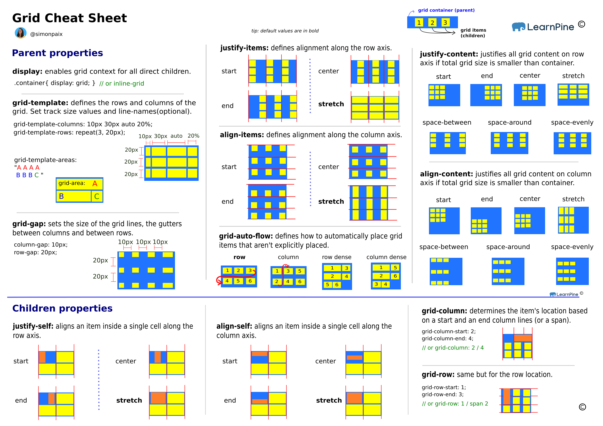

# CSS Notes

---

## CSS Basics

- `CSS (Cascading Style Sheets)`
- Used to style HTML elements.
- `Syntax:` Selector { property: value; }

```css
p {
  color: red;
}
```

---

## CSS Comments

- used to `add explanatory notes` in the CSS code.

```css
/* This is a comment */
```

---

## How to Add CSS

1. `Inline:` `style="property: value;"` - Adds styles directly to an HTML element.

```html
<p style="color: red;">Hello, World!</p>
```

2. `Internal:` `<style>` tag in `<head>` - Styles apply to the entire document.

```html
<style>
  p {
    color: green;
  }
</style>
```

3. `External:` Linked `.css` file using `<link>` - Preferred method for reusability.

```html
<link rel="stylesheet" href="styles.css" />
```

---

## CSS Specificity

- Determines `which rule applies when multiple rules match` the same element.
- `Order of importance:`

```
Inline > ID Selector > Class/Attribute/Pseudo-Class > Element/Pseudo-Element.
```

- `Example:` Inline (1000), ID (100), Class (10), Element (1).

---

## CSS Selectors

- Used to `select elements` to apply styles.


---

## CSS Pseudo-Classes & Elements

- `Pseudo-Classes:` Apply styles based on element states (e.g., `:hover`).

```css
a:hover {
  color: red;
}
button:active {
  background-color: blue;
}
li:nth-child(2) {
  color: red;
}
p:first-child {
  font-weight: bold;
}
```

- `Pseudo-Elements:` Style parts of an element (e.g., `::before`).

```css
p::before {
  content: "Note: ";
  font-weight: bold;
}
p::after {
  content: ";";
}
p::first-letter {
  font-size: 2em;
}
p::first-line {
  font-variant: small-caps;
}
```

---

## CSS Colors

- Define the color of elements using different formats.
- `Formats:` `name`, `hex (#rrggbb)`, `rgb(r,g,b)`, `rgba(r,g,b,a)`.

```css
color: rgba(255, 0, 0, 0.5);
```

---

## CSS Background

- Set background styles for elements.
- `Properties:` `background-color`, `background-image`, `background-repeat`, `background-position`, `background-size`.

```css
background-image: url("image.jpg");
background-size: cover;
```

---

## CSS Gradient

### Linear Gradient

- Creates a `gradual transition` between `colors along a straight line.`
- `background: linear-gradient(direction, color1, color2, ...);`

```css
background: linear-gradient(to right, red 30%, blue 70%);
```

### Radial Gradient

- Creates a `gradual transition` between `colors radiating from a central point`.
- `background: radial-gradient(shape size at position, color1, color2, ...);`

```css
background: radial-gradient(circle, red, yellow, blue);
```

---

## Border CSS

- Define the border around elements.
- `Properties:` `border`, `border-width`, `border-style`, `border-color`.

```css
border: 1px solid black;
```

---

## Text CSS

- Style the text within elements.
- `Properties:` `color`, `text-align`, `text-decoration`, `line-height`, `letter-spacing`.

```css
text-align: center;
line-height: 1.5;
```

---

## Fonts CSS

- Set the font styles for text.
- `Properties:` `font-family`, `font-size`, `font-weight`, `font-style`.

```css
font-family: Arial, sans-serif;
font-size: 16px;
```

---

## Height and Width CSS

- Define dimensions of elements.
- `Properties:` `height`, `width`, `max-width`, `min-height`.

```css
height: 100px;
width: 50%;
```

---

## Box Model

- Concept describing element dimensions and spacing.
- `Components:` `margin`, `border`, `padding`, `content`.
- `Example:` Total width = Content + Padding + Border + Margin.

---

## Margin Collapse

- Adjacent margins of block elements overlap instead of adding up.
- `Example:` Two `div` elements with margins of 20px each will collapse to 20px, not 40px.

---

## Box and Text Shadow

- Add shadows to boxes or text.
- `Box-Shadow:` `box-shadow: x-offset y-offset blur-radius color;`
- `Text-Shadow:` `text-shadow: x-offset y-offset blur-radius color;`

```css
box-shadow: 2px 2px 5px gray;
text-shadow: 1px 1px 2px black;`
```

---

## CSS Display

- Specifies how an element is displayed.
- `Types:` `block`, `inline`, `inline-block`, `flex`, `grid`, `none`.

```css
display: flex;
```

---

## CSS Units

- Define measurement values in CSS.
- `Absolute:` `px`, `cm`, `mm`.
- `Relative:` `%`, `em`, `rem`, `vw`, `vh`.

```css
width: 50%;
font-size: 1.2em;
```

---

## CSS Outline

- Line drawn around an element, outside the border, without affecting layout.

```css
outline: 2px dotted red;
```

---

## CSS Links

- Style different link states.
- `States:` `a:link`, `a:visited`, `a:hover`, `a:active`.

```css
a:hover {
  color: green;
}
```

---

## CSS List

- Style list elements.
- `Properties:` `list-style-type`, `list-style-image`, `list-style-position`.

```css
list-style-type: circle;
```

---

## CSS Table

- Style table elements.
- `Properties:` `border-collapse`, `border-spacing`, `caption-side`.

```css
table {
  border-collapse: collapse;
}
```

---

## CSS Position

- Define positioning of elements.
- `Types:` `static`, `relative`, `absolute`, `fixed`, `sticky`.

### 1. `Static` (Default)

- `Behavior`: Default positioning; elements flow naturally.
- `Offsets`: `top`, `right`, `bottom`, `left` are ignored.

```css
div {
  position: static;
}
```

### 2. `Relative`

- `Behavior`: Element is positioned `relative to its original (static) position`.
- `Offsets`: Adjust the element's position using `top`, `right`, `bottom`, `left`.

```css
div {
  position: relative;
  top: 10px; /* Moves down by 10px */
}
```

### 3. `Absolute`

- `Behavior`: Positioned `relative to the nearest positioned ancestor` (not static). If no such ancestor, positioned relative to the `<html> (viewport)`.
- `Offsets`: Adjust the element's position using `top`, `right`, `bottom`, `left`.

```css
div {
  position: absolute;
  top: 20px;
  left: 50px;
}
```

### 4. `sticky`

- `Behavior`: Switches between relative and fixed based on scroll. Sticks within its containing block.
- `Offsets`: Requires at least one offset (`top`, `bottom`, etc.)

```css
div {
  position: sticky;
  top: 0;
}
```

---

## CSS Overlapping

- Control stacking order using `z-index`.

```css
z-index: 10;
```

---

## CSS Overflow

- Specify how content that overflows the container is handled.
- `Values:` `visible`, `hidden`, `scroll`, `auto`.

```css
overflow: auto;
```

---

## Float and Clear

- `Float:` Positions elements to the left or right.
- `Clear:` Prevents floating elements from affecting other elements.

```css
float: left;
clear: both;
```

---

## CSS Media Query

- Used for `responsive design` by applying styles based on device characteristics.

```css
@media only screen and (max-width: 600px) {
  body {
    background-color: lightblue;
  }
}
```

---

## CSS Flexbox

- Layout model for arranging elements in a flexible manner.
- `Parent Properties:` `display: flex`, `justify-content`, `align-items`, `flex-direction`.
- `Child Properties:` `flex-grow`, `flex-shrink`, `align-self`.

```css
display: flex;
justify-content: space-between;
```

## 

---

## CSS Grid

- Layout system for dividing space into rows and columns.
- `Parent Properties:` `display: grid`, `grid-template-columns`, `grid-gap`.
- `Child Properties:` `grid-column`, `grid-row`.

```css
display: grid;
grid-template-columns: repeat(3, 1fr);
grid-gap: 10px;
```

## 

---
